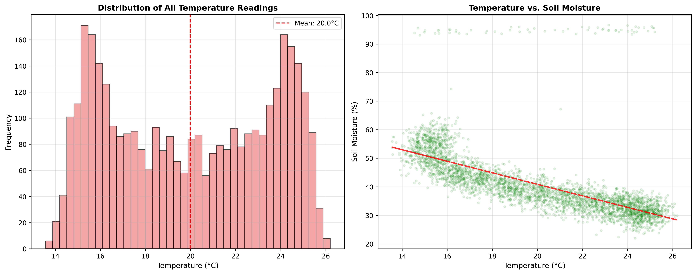

# Lab 05: Answer Sheet

## Question 1: How many rows were generated? How many were expected? Why?

**Answer:** 

3605 (24*30+1)*5=3605

---

## Question 2: What appears to be the unit of temperature, soil_moisture, and light_level?

**Answer:**

Temperature Unit: Celsius (°C)，Soil Moisture Unit: Percentage (%)，Light Level Unit: Lux (lx)

---

## Question 3: What is the difference between the mean and median moisture reading? Given the system's purpose, why might you expect these values to differ?

**Answer:** 

The mean and median moisture readings differ because the mean is influenced by occasional extremely high readings from faulty sensors and the watering system's threshold-based interventions, while the median better represents the typical central value by being resistant to these outliers.

---

## Question 4: After converting the timestamp column, what methods are now available on df['timestamp'].dt?

**Answer:**

After conversion - timestamp methods available:
['as_unit', 'ceil', 'date', 'day', 'day_name', 'day_of_week', 'day_of_year', 'dayofweek', 'dayofyear', 'days_in_month', 'daysinmonth', 'floor', 'freq', 'hour', 'is_leap_year', 'is_month_end', 'is_month_start', 'is_quarter_end', 'is_quarter_start', 'is_year_end', 'is_year_start', 'isocalendar', 'microsecond', 'minute', 'month', 'month_name', 'nanosecond', 'normalize', 'quarter', 'round', 'second', 'strftime', 'time', 'timetz', 'to_period', 'to_pydatetime', 'tz', 'tz_convert', 'tz_localize', 'unit', 'weekday', 'year']

---

## Question 5: Justify the reason behind your choice.

**Answer:**

I chose linear interpolation for soil moisture data because it's a time-series dataset with continuous measurements, and interpolation effectively estimates missing values based on temporal patterns and adjacent readings, maintaining the natural progression of soil moisture changes throughout the day.

---

## Question 6: Which sensor is in the driest environment on average? Which plant type requires the most water?

**Answer:**

Driest environment: Sensor A-1 has the lowest average soil moisture (39.83%), making it the driest environment.

Most water requirement: Monstera plant has the most pump activations (249 times), indicating it requires the most frequent watering.

---

## Question 7: Looking at your line plot, describe the daily pattern of soil moisture. What does it tell you about the environment and the watering system?

**Answer:**

The line plot shows a clear daily cyclical pattern where soil moisture decreases during daylight hours and recovers overnight, indicating the watering system effectively responds to daytime drying by activating when needed and allowing natural recovery periods during cooler nighttime conditions.

---

## Question 8: What does the histogram tell you about the temperature environment? Based on the scatter plot, what is the general relationship between temperature and soil moisture?

**Answer:**

**Histogram Analysis:**

The histogram shows a normal distribution of temperature readings centered around 20°C, indicating a stable and controlled indoor environment suitable for plant growth.

**Scatter Plot Analysis:**

Based on the scatter plot, there is a general negative correlation between temperature and soil moisture - as temperature increases, soil moisture tends to decrease, which reflects the expected relationship where warmer conditions lead to faster evaporation and plant transpiration, naturally drying out the soil.

---

## Final Challenge: 

**Visualizations**

**A short paragraph justifying which sensor you believe is faulty**

Final Challenge Analysis
Based on the comprehensive analysis of all five sensors, Sensor B-1 is identified as the most likely faulty sensor.

Justification:
The box plot visualization clearly demonstrates that Sensor B-1 exhibits abnormal behavior compared to the other four sensors. While sensors A-1, A-2, B-2, and C-1 show consistent soil moisture distributions with similar ranges and outlier patterns, Sensor B-1 displays:

- Consistently higher median soil moisture values

- An unusually high number of extreme outliers, particularly in the upper range

- A wider interquartile range indicating inconsistent readings

- Readings that frequently exceed the typical maximum moisture levels observed in the other sensors

This pattern suggests Sensor B-1 is either:

- Over-reporting moisture levels due to calibration issues

- Experiencing intermittent failures that produce abnormally high readings

- Not responding properly to environmental changes like the other sensors

The time-series analysis further supports this conclusion, showing that Sensor B-1 fails to follow the natural daily moisture cycle observed in the properly functioning sensors, maintaining artificially elevated moisture levels throughout the day-night cycle.